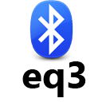

# ioBroker.eq3-thermostat

[](https://www.npmjs.com/package/iobroker.eq3-thermostat)
[](https://www.npmjs.com/package/iobroker.eq3-thermostat)


[](https://david-dm.org/Schnup89/iobroker.eq3-thermostat)
[](https://snyk.io/test/github/Schnup89/ioBroker.eq3-thermostat)

[](https://nodei.co/npm/iobroker.eq3-thermostat/)

**Tests:**: [](https://travis-ci.org/Schnup89/ioBroker.eq3-thermostat)


Adapter zur Anbindung von eq3-Thermostaten via Bluetooth

Mit diesem Adapter ist es möglich Informationen aus den Thermostaten auszulesen und die Soll-Temperatur zu setzen.
Voraussetzung ist Python und eine Bluetooth-Adapter inkl. Bluetooth-LowEnergy Funtkion (BTLE).

## Features
- Soll Temperatur eines Thermostats kann über "states" gesetzte werden
- Gesetzte Temperatur wird erst per Bluetooth an Thermostat übermittelt, nachdem der Wert 8 Sekunden nicht verändert wurde
- Wird am Thermostat selbst die Temperatur verändert wird dies über eine zyklische Ausleseroutine ausgelesen und die states gesetzt
- Einstellbarer Aktualisierungsintervall
- Folgende Eigenschaften werden ausgelesen
  - Soll Temperatur (temperature)
  - Ventilstellung (valve)
  - Batteriewarnung (low_battery_alarm)


<b>! WICHTIG !</b>

Die Thermostate werden in den Modus "Manuell" versetzt, sodass die Automatik am Thermostat nicht mehr genutzt werden kann.


Am Thermostat kann weiterhin die gewünschtt Temperatur Manuell eingestellt werden, bei der Aktualisierung wird der Wert in den IOBroker "states" übernommen.
Minimal einstellbare Temperatur 5°C (aus), Maximal einstellbare Temperatur 30°C 


## Vorbereitung und Überprüfung der Umgebung

Für diesen Adapter wird eine Python-Library genutzt welche installiert und getestet sein sollte.


### Schritt-für-Schritt Anleitung:

1. Verbinde dich per SSH oder Lokal auf die Konsole (bash) deines IOBroker Systems

2. Installieren der Python-Library "python-eq3bt"
```bash
pip install python-eq3bt
```
oder für Python3
```bash
pip3 install python-eq3bt
```
! Evtl. ein "sudo" voranstellen

2. Testen der Python-Library

Kopiere die Datei "eq3Controller.py" aus dem Repository-Ordner "python-script" oder erstelle Sie mit einem Text-Editor deiner Wahl.

Nun das Script noch für alle System-User ausführbar machen:  
```bash
sudo chmod +x eq3Controller.py
```

Sollte die Library richtig installiert und eingebunden sein, sollte folgendes Kommando die Befehle ausgeben:
```bash
python eq3Controller.py
```
oder mit Python3
```bash
python3 eq3Controller.py
```
Ist dies erfolgreich, so notiere dir den Pfad zu dieser Datei. Der aktuelle Pfad mit dem Kommando "pwd" in der Konsole ausgegeben.


## Bluetooth MAC-Adresse auslesen

Um später die EQ3-Thermostate ansprechen zu können beötigt der Adapter die MAC-Adresse und den Raum um die Thermostate zuordnen zu können.

Der Bluetooth-Name ist bei jeden Gerät geleich, sodass hier am besten ein Gerät nach dem anderen eingelesen werden sollte.

1. Batterie in eq3-Thermostat einsetzen (evtl. muss der Thermostat auch an ein Ventil angeschlossen sein <- Bitte kurze Rückmeldung per Issue)

2. BTLE Scan starten und warten (Bis zu 20 Sekunden)
```bash
sudo hcitool lescan
```

3. eq3-Thermostate erscheinen mit dem Namen "CC-RT-BLE", bitte die MAC-Adresse und den gewünschten Raum notieren.

Für jedes Gerät Schritt 1. bis 3. wiederholen.


## Adapterkonfiguration + Erster Start

Im Adapter kann nun der Pfad wie oben bei der Vorberitung notiert eingetragen werden.

Den Aktualisierungsintervall würde ich auf 2-5 Minuten einstellen. je länger der Intervall desto länger halten die Batterien des eq3-Thermostats.

Trage in der Liste unten mit dem "+" die MAC-Adresse und den Raum jedes Gerätes ein.

Sobald die Adapterkonfiguration gespeichert wird, sollten nach einer kurzen Wartezeit die Devices unter den Objekten angelegt werden.

```bash
eq3-thermostat.0.MAC-Adresse
``` 


## (Optional) Habpanel-Steuerung


Ich habe für Habpanel (ioBroker-Adapter für Visualisierung) ein für mich gutes Design entwickelt um vom Smartphone aus die Thermostate einstellen zu können.  
Dafür muss natürlich Habpanel installiert sein, und Ihr müsste folgende Einstellungen tätigen:

Ruft euer HABPanel auf und erstellt zwei Objekte, ein "template" und einen "knob" wie im Bild zusehen.

In das Template-Objekt folgenden Inhalt kopieren:

```html
<style>
.progress-bar {
    background-color: #0db9f0;
 }
.progress {
    height: 10px;
 }
</style>

<uib-progressbar style="background-color: #89a" animate="false"
max="100" value="itemValue('eq3-thermostat.0.MAC-Adresse.valve')">
</uib-progressbar>
``` 

<i>! "MAC-Adresse" im Pfad auf die MAC-Adresse des Thermostats anpassen !</i>

Und die Einstellungen für das "Knob"-Element:

```bash
General

Item: javascript.0.Thermometer.Wohnzimmer_Temp

Min: 5

Max: 29

Step: 0,5

Unit: °C

x Show Value

x Show Name

Bar & Track

Angles: Start 20, End 340

x Display previous value when dragging

Misc.

Font Size: 24
``` 


## Changelog

### 0.0.2
* (Schnup89) First Test & Documentation

### 0.0.1
* (Schnup89) initial release

## License
MIT License

Copyright (c) 2020 Schnup89 <Tobias_Tsafi@gmx.de>

Permission is hereby granted, free of charge, to any person obtaining a copy
of this software and associated documentation files (the "Software"), to deal
in the Software without restriction, including without limitation the rights
to use, copy, modify, merge, publish, distribute, sublicense, and/or sell
copies of the Software, and to permit persons to whom the Software is
furnished to do so, subject to the following conditions:

The above copyright notice and this permission notice shall be included in all
copies or substantial portions of the Software.

THE SOFTWARE IS PROVIDED "AS IS", WITHOUT WARRANTY OF ANY KIND, EXPRESS OR
IMPLIED, INCLUDING BUT NOT LIMITED TO THE WARRANTIES OF MERCHANTABILITY,
FITNESS FOR A PARTICULAR PURPOSE AND NONINFRINGEMENT. IN NO EVENT SHALL THE
AUTHORS OR COPYRIGHT HOLDERS BE LIABLE FOR ANY CLAIM, DAMAGES OR OTHER
LIABILITY, WHETHER IN AN ACTION OF CONTRACT, TORT OR OTHERWISE, ARISING FROM,
OUT OF OR IN CONNECTION WITH THE SOFTWARE OR THE USE OR OTHER DEALINGS IN THE
SOFTWARE.
